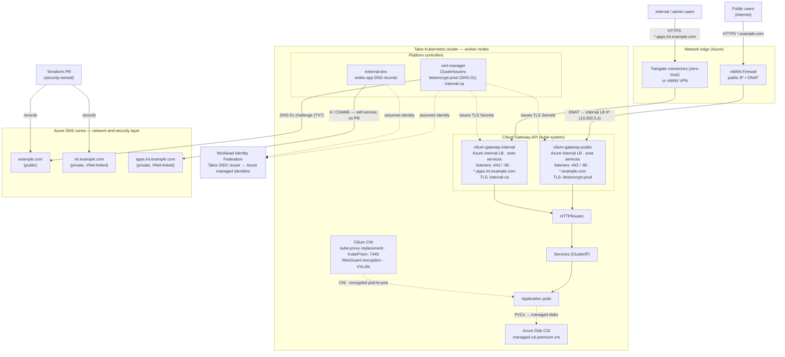

# Kubernetes Internals — App Traffic, DNS & Certificates (prod)

In-cluster view of how requests reach applications and how DNS records and TLS
certificates are provisioned. Complements `prod-network-topology.png` (the Azure
network / control-plane view). See [ADR-0005](../adr/0005-cert-manager-workload-identity.md)
and [ADR-0008](../adr/0008-dns-delegated-self-service.md) for the rationale.

## Traffic flows

- **Public app** — `Internet → vWAN Firewall (DNAT) → cilium-gateway-public
  (internal LB, snet-services) → HTTPRoute → Service → pods`. Hostnames under
  `*.example.com`; TLS from Let's Encrypt (`letsencrypt-prod`, DNS-01).
- **Internal app** — `admin/internal user → Twingate (or vWAN VPN) →
  cilium-gateway-internal (internal LB) → HTTPRoute → Service → pods`. Hostnames
  under `*.apps.int.example.com`; TLS from the in-cluster `internal-ca`.

## DNS ownership (three zones)

| Zone | Type | Who writes records | How |
|------|------|--------------------|-----|
| `example.com` | Public | Security | Terraform PR (+ cert-manager writes DNS-01 TXT) |
| `int.example.com` | Private (VNet-linked) | Security | Terraform PR |
| `apps.int.example.com` | Private (VNet-linked) | Developers | external-dns (Gateway/HTTPRoute annotation, **no PR**) |

external-dns holds a workload identity scoped to the **apps zone only**; cert-manager
holds a separate identity able to solve DNS-01 in the **public zone**. Both use
Talos OIDC → Azure federated identity credentials (no stored secrets).
